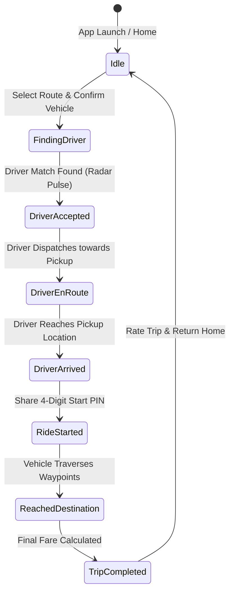
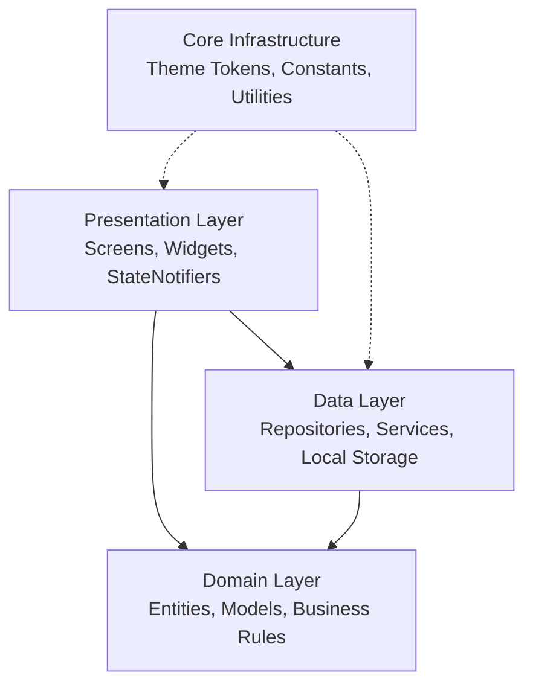

<div align="center">

  

  # 🚖 Vybe Cabs — Rider App

  **Next-Generation Urban Mobility & Ride-Hailing Experience**  
  *Built with Flutter, Riverpod, Firebase Authentication, and Google Maps SDK*

  <p align="center">
    <a href="https://flutter.dev"></a>
    <a href="https://dart.dev"></a>
    <a href="https://riverpod.dev"></a>
    <a href="https://firebase.google.com"></a>
    <a href="https://cloud.google.com/maps-platform"></a>
    <a href="#"></a>
    <a href="#"></a>
    <a href="LICENSE"></a>
  </p>

  <p align="center">
    <b>Safe rides across India, anytime.</b> Seamlessly combining city cabs, quick bike taxis, and eco-friendly Kolkata E-Rickshaws (Tirri / Toto) with multi-stop trip routing, live tracking simulations, and token-based design fidelity.
  </p>

</div>

---

## 📑 Table of Contents

- [📌 Overview](#-overview)
- [✨ Key Features](#-key-features)
  - [1. 🎨 Design System & Theme Engine](#1--design-system--theme-engine)
  - [2. 🗺️ Multi-Stop Route Selection & Google Maps SDK](#2-️-multi-stop-route-selection--google-maps-sdk)
  - [3. 🚖 Multi-Modal Vehicle Fleet](#3--multi-modal-vehicle-fleet)
  - [4. 📡 End-to-End Live Ride Simulation](#4--end-to-end-live-ride-simulation)
  - [5. 💳 Flexible In-Transit Payments & Ratings](#5--flexible-in-transit-payments--ratings)
  - [6. 💾 Dynamic Local Persistence](#6--dynamic-local-persistence)
  - [7. 🔐 Seamless Authentication & Onboarding](#7--seamless-authentication--onboarding)
- [🔄 Ride Lifecycle State Machine](#-ride-lifecycle-state-machine)
- [🏛️ Project Architecture](#️-project-architecture)
- [📂 Directory Structure](#-directory-structure)
- [🛠️ Tech Stack & Dependencies](#️-tech-stack--dependencies)
- [🎨 Vybe Design Tokens (Color Palette)](#-vybe-design-tokens-color-palette)
- [🚀 Getting Started & Local Setup](#-getting-started--local-setup)
  - [Prerequisites](#prerequisites)
  - [Installation Steps](#installation-steps)
  - [Google Maps API Configuration](#google-maps-api-configuration)
  - [Firebase Setup](#firebase-setup)
- [🧪 Testing & Verification](#-testing--verification)
- [📦 Build & Deployment](#-build--deployment)
- [🤝 Contributing & License](#-contributing--license)

---

## 📌 Overview

**Vybe Cabs Rider App** is a production-grade ride-hailing client application crafted in Flutter. Designed specifically for contemporary urban transit—with native first-class support for Indian metro dynamics (such as Kolkata's iconic E-Rickshaws / Toto)—the app provides a responsive, delightful rider journey from pickup dispatch to destination arrival.

### Core Highlights:
- **Zero Hardcoded Design Tokens**: Fully compliant with the Vybe design tokens specification (`colors.md` and `AppColors`).
- **Feature-First Riverpod Architecture**: Declarative state management with decoupled controllers, repositories, and domain models.
- **Standalone Simulation Engine**: Capable of demonstrating full end-to-end booking, driver search, driver route animation, and dynamic ride receipts without needing an active backend server.
- **Google Maps SDK Integration**: Custom styled map markers, waypoint interpolation, route polylines, and camera heading updates.

---

## ✨ Key Features

### 1. 🎨 Design System & Theme Engine
- **Universal Token Architecture**: Completely powered by `AppColors` semantic tokens (Primary Brand `#E64826`, Dark Neutral `#030204`, Soft Coral `#F2DFDD`).
- **Custom Typography**: Tailored typography hierarchy using the **Inter** font family (`Inter-Regular`, `Inter-Medium`, `Inter-SemiBold`, `Inter-Bold`, and `Inter-ExtraBold`).
- **Micro-Interactions**:
  - `VybeBounce`: Spring-scale tactile feedback on all interactive touchpoints.
  - `VybeCard`: Reusable elevated surfaces with soft drop shadows and subtle border outlines.
  - `VybeSkeleton`: Shimmering placeholder animations during async transitions.
  - `VybeAnimatedPulse`: Radar concentric ripple wave animation during driver matching.

---

### 2. 🗺️ Multi-Stop Route Selection & Google Maps SDK
- **Live Kolkata Center Coordinates**: Geocentric defaults focused on Kolkata (`2066, Nripen Ghosh Sarani Rd, Kolkata` / `22.5120° N, 88.3637° E`).
- **Intermediate Stops**: Riders can add multiple intermediate stops between pickup and destination.
- **Dynamic Fare Surcharge**: Transparently recalculates the total estimated fare in real time (Base Fare + **₹25** per additional stop).
- **Custom Map Markers**:
  - 🔵 **Pickup Marker**: Vibrant Azure circular pin with ring indicator.
  - 🟡 **Intermediate Stop**: High-contrast Yellow badge markers.
  - 🟠 **Destination**: Coral flame pin marking arrival points.
  - 🚗 **Vehicle Marker**: Animated vehicle icon with calculated bearing angle alignment.

---

### 3. 🚖 Multi-Modal Vehicle Fleet

Vybe Cabs offers a versatile vehicle selection tailored for varied urban travel needs and budgets:

| Vehicle Tier | Category | Seats | Base Fare | Avg. ETA | Description |
| :--- | :---: | :---: | :---: | :---: | :--- |
| **Vybe Go** | 🚗 Car | 4 | ₹185.00 | 3 mins | Affordable, compact AC sedans & hatchbacks for everyday commutes. |
| **Vybe Moto** | 🏍️ Bike | 1 | ₹55.00 | 2 mins | Swift two-wheeler ride to beat traffic congestion; includes safety helmet. |
| **Vybe Tirri** | 🛺 E-Rickshaw | 3 | ₹35.00 | 4 mins | Kolkata's iconic zero-emission Toto / E-Rickshaw for quick local hops. |
| **Vybe Prime Sedan** | 🚘 Luxury | 4 | ₹245.00 | 5 mins | Spacious premium sedans with complimentary Wi-Fi and chauffeur service. |

---

### 4. 📡 End-to-End Live Ride Simulation
The app features a realistic state machine engine (`tracking_controller.dart`) that mimics actual ride-hailing lifecycles:

1. **Finding Driver**: Interactive radar ripple pulse with real-time status banner: *"Waiting for drivers to accept your request"*.
2. **Driver Matched**: Populates verified driver credentials (photo, vehicle license plate `WB 06 H 4920`, 4.92★ rating, driver contact).
3. **Secure Start PIN**: Rider is presented with a unique 4-digit PIN (e.g., `4821`) required to start the trip.
4. **Driver En-Route Movement**: Smooth vehicle marker translation towards the rider's pickup spot with calculated real-time bearings.
5. **Driver Arrived**: Alert banner notifying the rider that the vehicle is stationed at the pickup point.
6. **Ride in Progress**: Vehicle moves along calculated polyline waypoints towards the destination.
7. **Destination Reached**: Seamless transition to the Trip Completion and Rating dialog.

---

### 5. 💳 Flexible In-Transit Payments & Ratings
- **Pay Anytime**: Riders have the flexibility to pay before departure, mid-journey, or upon reaching the destination.
- **Multiple Payment Gateways**:
  - 📱 **UPI**: Google Pay, PhonePe, Paytm, and BHIM UPI.
  - 💳 **Cards**: Credit & Debit Card payment options.
  - 💵 **Cash**: Direct driver cash settlement.
- **Trip Receipts**: Instant persistent receipt generation with fare breakdowns, driver details, and timestamps.
- **Interactive Ratings**: 5-star rating widget with dynamic compliment tags.

---

### 6. 💾 Dynamic Local Persistence
- Powered by `LocalStorageService` utilizing `shared_preferences`.
- Automatically persists:
  - User session tokens and profile information.
  - Saved favorite locations (Home, Office, Recent places).
  - Full ride history (pre-seeded with realistic trips; freshly completed rides are immediately saved and displayed reactively).

---

### 7. 🔐 Seamless Authentication & Onboarding
- **Branded Welcome & Splash**: High-resolution branding, animated splash transitions, and clean onboarding carousel.
- **Phone Number Authentication**: Clean phone formatting with country code handling.
- **Smart OTP Verification**: 4-digit individual input boxes with auto-detect simulation, countdown timer, and fallback banner.
- **Profile Setup**: Rider first name and optional last name registration.

---

## 🔄 Ride Lifecycle State Machine

The following diagram illustrates the state transitions managed by `tracking_controller.dart`:



---

## 🏛️ Project Architecture

Vybe Cabs follows Riverpod's **Feature-First Layered Architecture**, ensuring strict separation of concerns, high testability, and modular maintainability:



- **`core/`**: Shared theme engine (`AppColors`, `AppTypography`), reusable atomic widgets (`VybeButton`, `VybeCard`, `VybeTextField`), route geometry utilities (`RouteUtils`, `MapMarkerUtils`), and services (`LocalStorageService`, `LocationService`).
- **`features/`**: Domain-segregated slices containing their own `presentation/`, `data/`, and `domain/` sub-packages:
  - `auth/`: Splash, Phone login, OTP verification, and user state.
  - `home/`: Dashboard, commute cards, quick rides, account sheets.
  - `booking/`: Multi-stop location selector, vehicle tier sheet, fare calculations.
  - `tracking/`: Google Maps live tracking, vehicle animations, payment sheet, trip completion.
  - `history/`: Paginated ride history and stored trip receipts.

---

## 📂 Directory Structure

```
vybecabs_rider/
├── assets/
│   ├── fonts/
│   │   └── Inter/                      # Inter Font Suite (Regular to ExtraBold)
│   └── images/
│       └── logo.png                    # Official Vybe Cabs high-res logo
├── lib/
│   ├── core/
│   │   ├── constants/
│   │   │   └── app_constants.dart      # Application coordinates, constants & keys
│   │   ├── services/
│   │   │   ├── local_storage_service.dart  # SharedPreferences persistence service
│   │   │   ├── location_service.dart       # Device GPS & geocoding handler
│   │   │   └── location_search_service.dart# Landmark & places query engine
│   │   ├── theme/
│   │   │   ├── app_colors.dart         # Semantic color tokens (colors.md specification)
│   │   │   ├── app_typography.dart     # Inter font styles & text hierarchy
│   │   │   └── app_theme.dart          # Flutter Material 3 ThemeData
│   │   ├── utils/
│   │   │   ├── map_marker_utils.dart   # Custom Canvas marker bitmap generators
│   │   │   └── route_utils.dart        # Bearing math & multi-stop waypoint interpolation
│   │   └── widgets/
│   │       ├── vybe_animated_pulse.dart# Radar concentric ripple search widget
│   │       ├── vybe_badge.dart         # Status badges & pill indicators
│   │       ├── vybe_bottom_sheet.dart  # Modal bottom sheet wrappers
│   │       ├── vybe_bounce.dart        # Spring scale touch interaction wrapper
│   │       ├── vybe_button.dart        # Primary, secondary, and tonal buttons
│   │       ├── vybe_card.dart          # Elevated surface containers
│   │       ├── vybe_skeleton.dart      # Shimmer loading placeholders
│   │       └── vybe_text_field.dart    # Custom styled text inputs
│   ├── features/
│   │   ├── auth/                       # Authentication feature slice
│   │   ├── booking/                    # Route planner & vehicle selection
│   │   ├── history/                    # Past ride logs & receipts
│   │   ├── home/                       # Main dashboard, banners & shortcuts
│   │   └── tracking/                   # Live tracking, driver simulation & payments
│   ├── firebase_options.dart           # Firebase platform configuration
│   └── main.dart                       # App entrypoint & ProviderScope initialization
├── test/
│   └── booking_and_tracking_test.dart  # Unit tests for controllers, storage & utils
└── pubspec.yaml                        # Project metadata & dependencies
```

---

## 🛠️ Tech Stack & Dependencies

| Technology | Category | Purpose |
| :--- | :--- | :--- |
| **Flutter 3.13+** | Mobile Framework | Cross-platform UI development for Android & iOS |
| **Dart 3.13+** | Language | Strongly typed language with null safety |
| **Flutter Riverpod (`^2.6.1`)** | State Management | Reactive, compile-safe dependency injection and state handling |
| **Google Maps Flutter (`^2.18.1`)** | Mapping SDK | Interactive maps, camera animations, polylines, and custom markers |
| **Firebase Core & Auth (`^4.15.0`)** | Authentication | Phone authentication, credentials handling, and secure login |
| **Shared Preferences (`^2.3.5`)** | Local Storage | Dynamic offline persistence of profiles, trips, and settings |
| **Geolocator (`^13.0.2`)** | Location | GPS position retrieval and permission handling |
| **Geocoding (`^5.0.0`)** | Geocoding | Reverse geocoding of coordinates into street addresses |
| **Intl (`^0.20.2`)** | Formatting | Date, time, currency, and numerical string formatting |
| **UUID (`^4.5.1`)** | Identifiers | Cryptographic generation of unique trip and transaction IDs |

---

## 🎨 Vybe Design Tokens (Color Palette)

All colors strictly implement the design token specification defined in `colors.md`:

| Token Name | Hex Code | Preview | Semantic Usage |
| :--- | :---: | :---: | :--- |
| `AppColors.primary` | `#E64826` |  | Primary brand action, buttons, highlight borders |
| `AppColors.primaryHover` | `#E42202` |  | Pressed and active state for primary buttons |
| `AppColors.primarySoft` | `#F2DFDD` |  | Brand background tint, selection highlights |
| `AppColors.background` | `#FCFCFC` |  | Base scaffold background color |
| `AppColors.surface` | `#FFFFFF` |  | Cards, modal sheets, elevated surfaces |
| `AppColors.textPrimary` | `#030204` |  | High-emphasis body text, titles, headings |
| `AppColors.textSecondary` | `#4B4A4C` |  | Secondary subtitles, labels, details |
| `AppColors.border` | `#E8E9EA` |  | Standard card borders and dividers |
| `AppColors.success` | `#1FA64A` |  | Trip completed, payment verified, active status |
| `AppColors.warning` | `#D98A00` |  | Intermediate stops, pending indicators |
| `AppColors.info` | `#3983F0` |  | Azure pickup markers, info callouts |

---

## 🚀 Getting Started & Local Setup

### Prerequisites
- **Flutter SDK**: `>= 3.13.0`
- **Dart SDK**: `>= 3.13.3`
- **Android Studio** (with Android SDK 34+) or **Xcode** (15+)
- An active **Google Cloud Console** account with Google Maps SDK enabled.

### Installation Steps

1. **Clone the Repository**:
   ```bash
   git clone https://github.com/I-Am-Mohan/VybeCabs-Rider-App-Flutter.git
   cd VybeCabs-Rider-App-Flutter
   ```

2. **Install Flutter Dependencies**:
   ```bash
   flutter pub get
   ```

3. **Verify Flutter Setup**:
   ```bash
   flutter doctor
   ```

---

### Google Maps API Configuration

To enable live map rendering, configure your Google Maps API key for both platforms:

#### Android Configuration
Open `android/app/src/main/AndroidManifest.xml` and insert your API key inside the `<application>` tag:

```xml
<meta-data
    android:name="com.google.android.geo.API_KEY"
    android:value="YOUR_GOOGLE_MAPS_ANDROID_API_KEY"/>
```

#### iOS Configuration
Open `ios/Runner/AppDelegate.swift` and configure the Google Maps service:

```swift
import UIKit
import Flutter
import GoogleMaps

@main
@objc class AppDelegate: FlutterAppDelegate {
  override func application(
    _ application: UIApplication,
    didFinishLaunchingWithOptions launchOptions: [UIApplication.LaunchOptionsKey: Any]?
  ) -> Bool {
    GMSServices.provideAPIKey("YOUR_GOOGLE_MAPS_IOS_API_KEY")
    GeneratedPluginRegistrant.register(with: self)
    return super.application(application, didFinishLaunchingWithOptions: launchOptions)
  }
}
```

---

### Firebase Setup

Firebase is initialized in `lib/main.dart` with platform options from `lib/firebase_options.dart`.

To link your own Firebase project:
1. Install FlutterFire CLI:
   ```bash
   dart pub global activate flutterfire_cli
   ```
2. Configure credentials:
   ```bash
   flutterfire configure
   ```

---

## 🧪 Testing & Verification

Vybe Cabs includes a comprehensive test suite verifying the local storage layer, state transitions, fare calculator, and route math:

```bash
# Run all unit tests
flutter test
```

### Covered Test Suites (`test/booking_and_tracking_test.dart`):
- ✅ **LocalStorageService**: Verifies empty state handling, profile mutation, and new trip prepending.
- ✅ **BookingController**: Tests dynamic fare recalculation across multi-stop routes and vehicle switching.
- ✅ **TrackingController**: Validates transition into `findingDriver` stage, driver matching, and payment status updates.
- ✅ **RouteUtils**: Asserts multi-stop waypoint interpolation order (Pickup ➡️ Stops ➡️ Drop-off) and mathematical bearing calculations.

---

## 📦 Build & Deployment

To generate deployment binaries:

### Build Android APK
```bash
# Debug APK
flutter build apk --debug

# Release APK
flutter build apk --release
```
*Output artifact located at: `build/app/outputs/flutter-apk/app-release.apk`*

### Build Android App Bundle (for Google Play Store)
```bash
flutter build appbundle --release
```

### Build iOS (Requires macOS & Xcode)
```bash
flutter build ios --release --no-codesign
```

---

## 🤝 Contributing & License

Contributions, bug reports, and feature requests are welcome!

1. Fork the Project.
2. Create your Feature Branch (`git checkout -b feature/AmazingFeature`).
3. Commit your Changes (`git commit -m 'feat: Add AmazingFeature'`).
4. Push to the Branch (`git push origin feature/AmazingFeature`).
5. Open a Pull Request.

Distributed under the **MIT License**. See `LICENSE` for more information.

---

<div align="center">
  <sub>Crafted with care by <b><a href="https://github.com/I-Am-Mohan">Mohan</a></b> • Vybe Cabs Engineering</sub>
</div>
